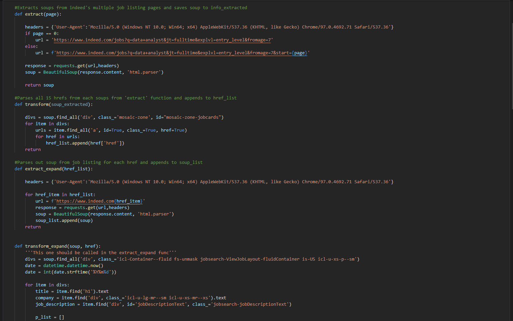
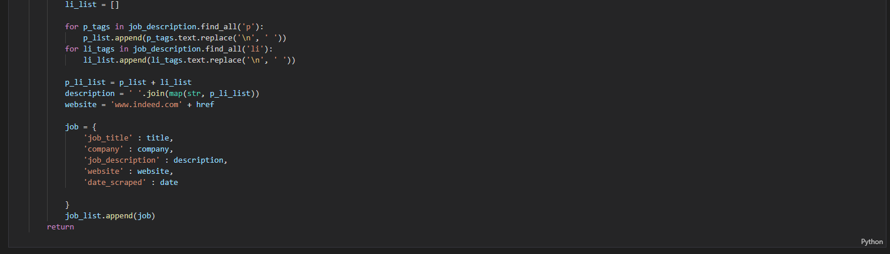
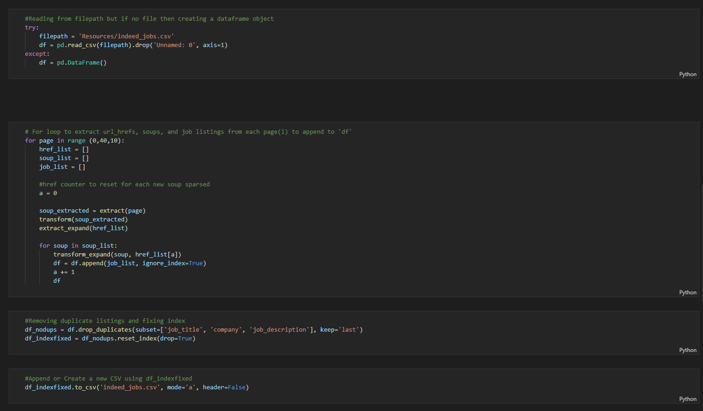
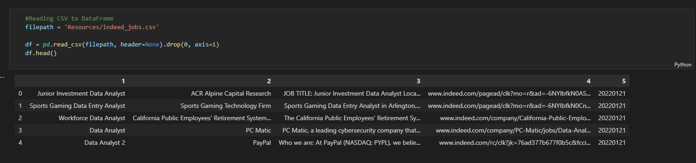
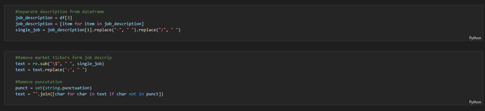
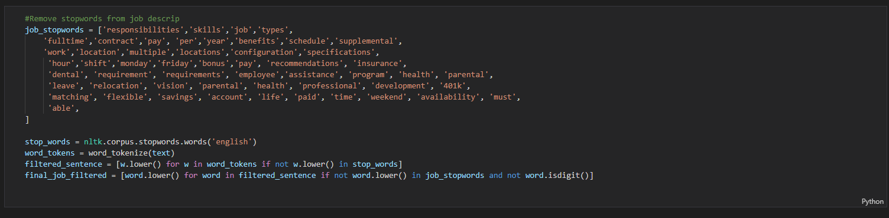
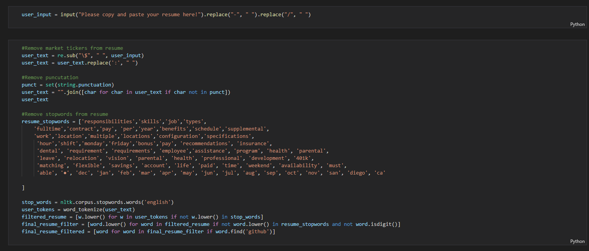
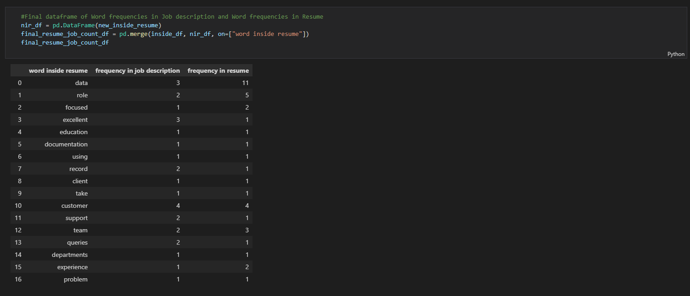
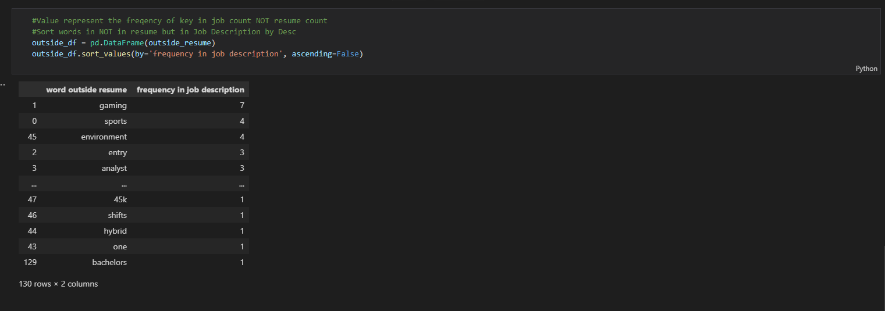
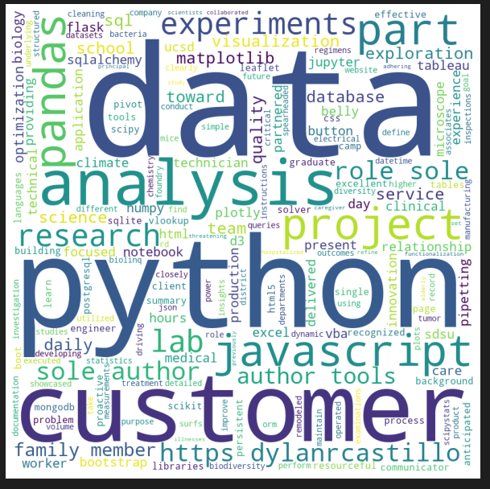

# Indeed Web Scraper

## Background

Using an ETL process to scrap Indeed job listing information and analyzing and visualizing word frequencies to optimize resume performance.

## Objective

## Part 1:
### Extract, Transform, and Load

* 4 Functions, including:
  * First extract & transform functions to grab url for each job listing
  * Second extract_expand & transform_expand function to grab the job title, company, job description, website, and date scraped saving information into a dicitonary.

  
  
  
 * For loop, including:
   * Runs all the above functions to webscrape and save information into a CSV for later use

   

## Part 2:
### Data Cleaning

* Create an overview table of CSV, including:
  * Company
  * Job Description
  * Website
  * Date Scraped
  

### Cleaning

* Separating and removing any unnecessary tickers from job description. Includes:
  * "-", "/", "$", ":"

  

### Filtering & Tokenizing

* Create a list of job listing stop words and uses a list comprehension to only saving relevant word tokens. Includes:

  

* Create a list of resume stop words and uses a list comprehension to only saving relevant word tokens. Includes:

  

### Saving to DataFrame

* Looping through words inside resume and checking if they are in job description.

  

* Looping through words inside job description and checking if they are in resume.

  

### Visualizing Results

* Visualized word frequencies using world cloud. Includes:
  * Job Listing
  
  
 
  * Resume

  
 
